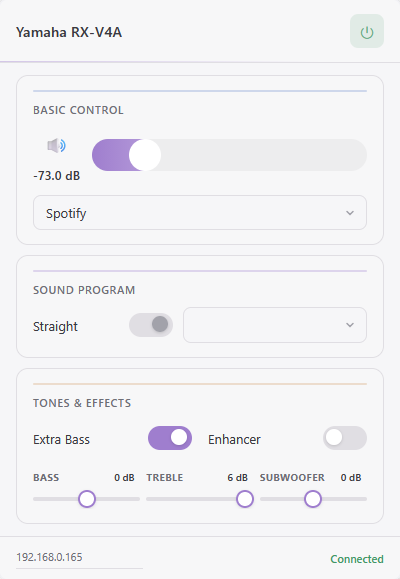

# Yamaha AVR Remote

A Firefox extension that turns the browser into a remote for your Yamaha AV receiver.

[![Firefox Add-ons][amo-badge]][amo-link]

[amo-badge]: https://img.shields.io/amo/rating/yamaha-avr-remote?label=Firefox&style=for-the-badge&logo=firefoxbrowser
[amo-link]: https://addons.mozilla.org/firefox/addon/yamaha-avr-remote/

## Features

- Power on / standby
- Volume slider with dB display and mute
- Input source selection (list pulled from the receiver)
- Sound programs and Straight mode
- Bass, treble and subwoofer tone controls
- Extra Bass and Enhancer toggles
- Live status — the popup auto-refreshes the receiver's state

The extension talks directly to the receiver's built-in HTTP API
(YamahaExtendedControl) on port 80. Inputs, sound programs and
volume/tone ranges are read from the receiver itself, so it adapts to any
supported Yamaha model. No data is collected or sent anywhere except the
local receiver.



## Usage

1. Install the extension.
2. Open the popup and enter your receiver's IPv4 address in the footer
   field. It is saved via `chrome.storage` and reused on the next open.
3. Use the controls. The popup reconnects automatically when opened.

## Development

```sh
npm install
npm run dev      # run in a temporary Firefox profile
npm run lint     # web-ext lint
npm run build    # package to web-ext-artifacts/
npm run icons    # regenerate icon PNGs from icons/icon.svg (dev only)
```

There is no build step — the XPI is the source itself (plain HTML/CSS/JS).

## Project layout

- `manifest.json` — MV2 manifest, `storage` + `http://*/*` permissions
- `background/service-worker.js` — all HTTP calls to the receiver API
- `popup/` — popup UI and state (`api.js` fetches/caches features,
  `controls.js` wires up the controls, `state.js` holds state and storage)
